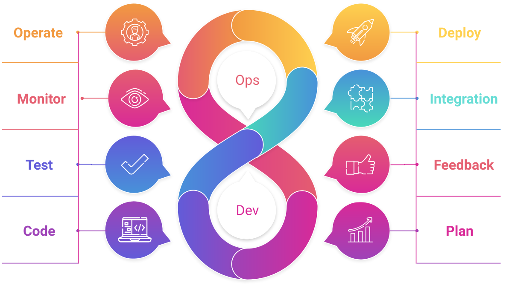
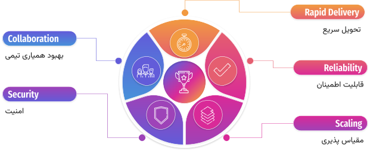
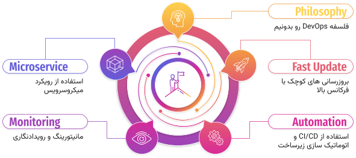
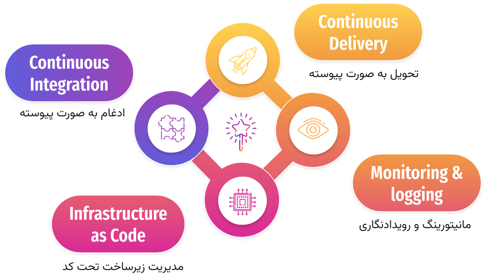
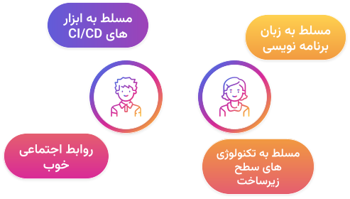

به نام خدا

# مقدمه‌ای بر DevOps ابزار یا نوعی نگرش
 
## هدف DevOps
هر زمان که واژه DevOps رو می شنویم، بعد از اون CI/CD به ذهنمون میرسه یا کلی ابزار که ما علاقه داریم از اون‌‌ها در سازمان خودمون استفاده کنیم. اما آیا DevOps محدود به همین‌ها میشه؟ در حقیقت DevOps مجموعه ای از نگرش یا فرهنگ سازمانی، فعالیت‌ها و ابزارهایی است که به سازمان کمک می‌کنه محصول نهایی رو خیلی سریعتر به مشتری تحویل بده و در نهایت باعث میشه مشتری راضی‌تر باشه و سازمان بتونه با رقبا بهتر رقابت کنه. در این مقاله قصد داریم علاوه بر بخش‌های چرخه DevOps، هدف و فلسفه DevOps رو تشریح کرده و  راه‌های تطبیق سازمان خودمون با اون رو بیان کنیم.

## DevOps چطور کار میکنه
اول از همه از خود شکل بی‌نهایت که به عنوان نماد DevOps شناخته میشه شروع کنیم. این شکل بر پایه مفهوم توسعه افزایشی یا incremental بنا شده. در رویکردهای سنتی توسعه نرم‌افزار مثل مدل آبشاری یا waterfall که در اون از فاز برنامه‌ریزی تا توسعه و تحویل به صورت ترتیبی انجام می‌شد و در نهایت بعد از صرف زمان زیاد، میتونستیم کاربر رو با محصول نهایی روبرو کنیم(که معمولا کاربرا با 99 درصدش مخالف بودن و البته خیلی‌ها هنوز هم از همین روند استفاده می‌کنند). در مدل افزایشی، ابتدا یک محصول با قابلیت‌های حداقلی ولی قابل ارائه به مشتری ایجاد میشه. بعد از گرفتن بازخورد از مشتری و اعلام رضایت‌، محصول توسعه داده شده و بزرگتر میشه. دوباره از مشتری بازخورد گرفته و این چرخه تکرار میشه تا محصول‌ بزرگتر و نیازمندی‌های مشتری تکمیل بشه. در این حالت، مشتری راضی‌تر هست چون در توسعه پروژه سهیم بوده و محصول با کیفیت و خلاقانه‌ای توسعه پیدا کرده و در طول زمان نواقص اون برطرف شده،(یه توضیح مختصر و مفیدی بود از مانیفست Agile).
 اما این شکل بی‌نهایت DevOps چه فازهایی داره (خیلی سادست):

* **Plan یا برنامه‌ریزی:** نقطه صفر ما برای شروع کار اینجاست. تولد محصول ما. برنامه‌ریزی و بررسی نیازهایی که محصول ما باید در وهله اول اون‌ها رو پوشش بده.
* **Code یا کدنویسی:** بعد از استخراج کارها باید اون‌ها رو پیاده‌سازی کنیم.
* **Test یا آزمون:** هر بخشی رو که توسعه‌دادیم باید اول اون رو تست کنیم تا تأیید و اعتبارسنجی بشه (validation & verification).
* **integration یا ادغام:** بعد از اطمینان از عملکرد ویژگی جدید، اون رو با بقیه کدها و ویژگی‌ها ادغام می‌کنیم.
* **Deploy یا تحویل:** بعد از اینکه ویژگی‌هایی که برای اون‌ها برنامه‌ریزی کرده بودیم تکمیل شد، باید محصول رو نصب کنیم یا به عبارتی تحویل مشتری یا تیم اجرایی بدیم.
* **Operate یا اجرا:** اینجا تیم زیرساخت یا اجراییات سخت مشغول کار میشن تا محصول رو بررسی کرده، زیرساخت رو چک کنند و در صورت نیاز تغییراتی رو انجام بدن تا همه چی به درستی کار کنه.
* **Monitor یا رصد:** در زمانی که محصول زیر بار عملیاتی بوده و مشتری مشغول کار با اون هست، باید صحت و درستی عملکردش رصد و بررسی بشه، تا مطمئن بشیم ویژگی‌هایی که پیاده‌سازی شدن همون طوری که باید کار می‌کنند.
* **Feedback یا بازخورد:** بر اساس بررسی‌های انجام شده و نظر مشتری، برای فاز بعدی برنامه‌ریزی میشه. ممکنه در این مرحله مشکلاتی وجود داشته یا ویژگی‌ها به اون نحوی که مشتری خواسته پیاده‌سازی نشده. همه اینها به همراه نیازمندی‌های جدید برای مرحله بعد برنامه‌ریزی و وارد چرخه میشن.
* **و تکرار ….**
## اما همین مقدار کافی نیست!
در مورد چرخه و فازهای DevOps صحبت کردیم، اما نکته‌ای وجود داره که بدون در نظر گرفتن اون نمی‌تونید فازها رو عملیاتی کنید. واژه DevOps تشکیل شده از Development و Operation. هر سازمان افرادی رو داره که مسئولیت توسعه محصول رو بر عهده(Dev) دارند و افرادی که دغدغه آماده‌سازی زیرساخت در محیط عملیاتی و استقرار یا تحویل محصول به مشتری رو بر عهده دارند(Ops). اگر بخواهیم DevOps رو در روند توسعه استفاده کنیم، باید تیم توسعه با تیم اجرایی ترکیب بشه. این دو تیم از هم مجزا نیستند و یک واحد کاری رو تشکیل می‌دهند. افراد، مجموعه‌ای از توانمندی‌ها رو دارند و متمرکز به یک موضوع خاص نیستند. همه اعضای تیم دغدغه توسعه، تست و استقرار محصول رو دارند. سعی می‌کنند برای سرعت بخشیدن به اون، بخش‌های جدید رو ایجاد کنند یا روال های قدیمی و کند رو با ابزار، اتوماتیک کنند. در برخی از مدل‌های DevOps حتی تیم‌های تضمین کیفیت و امنیت با تیم‌های توسعه و اجرایی ادغام شدند.
به عنوان مثال یکی از فازهای DevOps، فاز monitor هست. منظور ما تنها زیرساخت و شبکه و سرورها نیست بلکه مانیتورینگ سطح برنامه کاربردی رو هم شامل میشه. مثلا محصول ما چه متریک‌هایی رو میتونه به ما اعلام کنه تا بشه با جزئیات بیشتری اون رو بررسی کرد مثل تعداد کاربران فعال، تعداد درخواست‌هایی که موفق هستند و درخواست هایی که با خطا مواجه شدند. همه این ها یعنی تنها تیم اجرایی نباید به فکر مانیتورینگ باشه و تیم توسعه هم باید برای بلوک‌های چرخه DevOps کاری رو انجام بده.

## مزیت‌های DevOps
سرعت تولید نسخه و استقرار یا تحویل آن به مشتری افزایش پیدا می‌کنه. هر چه این سرعت بیشتر بشه شما می‌تونید مشکلات بیشتری رو مرتفع و ویژگی‌های بیشتری از محصول رو به مشتری عرضه کنید. ادغام پیوسته (continuous integration) و تحویل پیوسته (continuous delivery) فعالیت‌هایی هستند که به واسطه اون‌ها میتونید فرآیند ساخت، تولید نسخه و استقرار و تحویل رو اتوماتیک کنید.

**قابلیت اطمینان (Reliability)**
با هر بروزرسانی و تغییر محصول از کیفیت اون اطمینان پیدا کنید، این خیلی مهمه که شما بتونید سیستم رو توسعه بدید ولی مشکلات جدیدی ایجاد نکنید یا اگر مشکلی هم ایجاد شد، به سرعت متوجه بشید، قبل از اینکه به دست مشتری برسه. تست پیوسته (continuous testing) فعالیتی که می‌تونید تست‌های خودتون رو به صورت اتوماتیک با هر بار تغییر محصول، اجرا کنید تا مشکلات رو به سرعت کشف و برطرف کنید.
**مقیاس پذیری (Scaling)**
مدیریت و اجرای محصول در مقیاس‌های بزرگ، اتوماتیک‌سازی روندها و سازگاری سرویس‌ها به شما کمک میکنه بتونید تغییرات ایجاد شده روی محصول‌تون رو با ریسک کمتری مدیریت کنید. این تغییرات میتونه شامل افزایش شدید درخواست‌ها در بازه خاصی از زمان از سمت کاربران باشه و نیاز داره تا سرویس یا محصول رو با این شرایط تطبیق بدید (scale-up). تغییرات حتی میتونه کاهش درخواست‌ها به سرویس شما باشه. در این حالت باید بتونید منابعی که در اختیار دارید آزاد کنید(scale-down). فعالیتی مثل مدیریت زیرساخت تحت کد (infrastructure as code) میتونه محیط استقرار یا تست محصول رو با استفاده از فایل‌های تنظیمات به راحتی مدیریت کنه.
**بهبود همیاری تیمی(Improve Collaboration)**
ترکیب تیم های توسعه و اجرایی به همراه نقش داشتن همه اعضای گروه در تمامی چرخه توسعه باعث میشه همه اعضا نسبت به اهدافی که محصول میخواد به اون برسه مسئولیت پذیرتر باشن. تیم برای رفع مشکلات همکاری کنند. همچنین باعث میشه درک صحیحی از نیازمندی های کاربر و ویژگی های محصول داشته باشند.
**امنیت(Security)**
توسعه سریع باید همراه با تامین امنیت سیستم باشه. با استفاده از نگرش shift-left-security میشه امنیت رو در سطح کد یا در حین توسعه بررسی کرد که بیشترین مخاطرات مربوط به همین سطح میشه. توسعه با درنظرگرفتن معیارهای امنیتی به شما کمک میکنه مشکلات رو از منشا اون پیدا و حل کنید. حتی برای مخاطرات برنامه داشته باشید. نگرش shift-left-security به شما اطمینان میده که تیم توسعه میتونه خودش رو با معیارها و نیازمندی‌های امنیتی پروژه منطبق کنه. توسعه سریع نباید با قربانی کردن امنیت همراه باشه.
## چطور به سمت DevOps حرکت کنیم

### فلسفه DevOps رو بدونیم
رفتن به سمت DevOps نیازمند تغییر در طرز فکر و فرهنگ سازمانی هست. به زبان ساده DevOps موانع بین تیمهای مجزای توسعه و اجرایی رو برمیداره. دقت کنید هدف این نیست که تیم نداشته باشیم و همه در یک تیم ادغام بشن؛ بلکه ما نیاز داریم هر دو تیم باهم کار کنند و هماهنگ باشن، تا بتوانند بهره‌وری توسعه رو افزایش دهند و هم نسبت به فرآیندهای اجرایی اطمینان خاطر ایجاد بشه. هر دو تیم باید تلاش کنند به صورت مکرر با هم ارتباط داشته باشند، تا کیفیت محصول یا سرویس برای مشتری افزایش پیدا کنه. افراد فارغ از سمت یا مسئولیتی که دارند باید این طور فکر کنند که کاربر نهایی چه نیازی داره و چطور میشه با مشارکت نیازمندی رو برطرف کرد. تیم‌های تضمین کیفیت و امنیت هم باید با این تیم‌ها همراه بشن. سازمان‌هایی که تفکر DevOps رو به جای رویکرد سنتی چارت سازمانی پذیرفتن، تیم هایی دارند که تمامی بخش‌ها اعم از توسعه و زیرساخت رو، مسئولیت خودشون میدونند.
### فعالیت‌های پایه ای  DevOps رو اجرایی کنیم
چند فعالیت کلیدی وجود دارد که به سازمان‌ها کمک میکنه سریعتر نوآوری داشته باشند. این سرعت با استفاده از ساده‌سازی و اتوماتیک‌سازی توسعه محصول و فرآیند‌های مدیریت زیرساخت، امکان پذیره. اصلی‌ترین فعالیت DevOps، **بروزرسانی‌های کوچک با فرکانس بالاست**. در این فعالیت تعداد بروزرسانی‌ها به مراتب بیشتر از رویکردهای سنتی مبتنی به تولید نسخه (release) هست. بروزرسانی های کوچک ولی مکرر ریسک توسعه رو کاهش میده و کمک می‌کنه تا تیم باگ‌ها رو زودتر پیدا کنه.
فعالیت بعدی استفاده از معماری **میکروسرویس**(microservice) هست. سازمان‌هایی که از معماری میکروسرویس استفاده می کنند محصولاتی به مراتب منعطف‌تر و با نوآوری بیشتری ایجاد می‌کنند. در یک معماری میکروسرویس، یک سیستم پیچیده و بزرگ به پروژه‌ها یا برنامه‌های مستقلی تبدیل میشه که به هر کدام از اون‌ها سرویس میگیم. هر سرویس، محدوده و عملکرد مخصوص به خودش رو داره و به صورت مستقل عمل میکنه. در نهایت جمع این سرویس‌ها در کنار هم، اپلیکیشن ما رو میسازه. معماری میکروسرویس، سربار هماهنگی بروزرسانی (یعنی تو هر بروزرسانی باید حواست به یه عالمه وابستگی بین ویژگی‌ها و بخش‌های مختلف باشه که اگه یکیش کار نکه، کل اپلیکیشن رو هواست) رو به مراتب کاهش میده و میشه هر سرویس رو به یک تیم کوچیک و agile سپرد تا بتونه خیلی سریع کارها رو مدیریت کنه.
 اگرچه ترکیب معماری میکروسرویس و ایده بروزرسانی های کوچک و مکرر میتونه سربار زیادی رو برای بخش استقرار ایجاد کنه و چالش برانگیز باشه ولی فعالیت‌های DevOps دیگری مثل ادغام و تحویل به صورت پیوسته (CI/CD)، میتونه این مشکل رو حل کنه تا بروزرسانی های مطمئنی داشته باشیم.
**اتوماتیک‌سازی زیرساخت** مثل مدیریت زیرساخت تحت کد، میتونه زیرساخت منعطفی (یا elastic) رو برای شما فراهم کنه به این معنی که می‌تونید به راحتی زیرساخت، منابع پردازشی و ذخیره سازی تون رو مدیریت کنید و پاسخگوی تغییرات مکرر باشید.
فعالیت **مانیتورینگ و رویدادنگاری**هم کمک می‌کنه عملکرد و کارایی اپلیکیشن و زیرساخت رو بررسی کنید و بتونید نسبت به مشکلات، واکنش سریعی داشته باشید.
فعالیت‌هایی که ذکر شد کمک می‌کنند سازمان شما سریعتر سرویس‌ها رو تحویل بده و بروزرسانی‌های مطمئن‌تری برای مشتری ها داشته باشه.

## شرح فعالیت های DevOps

**ادغام به صورت پیوسته (Continuous Integration)**
یکی از فعالیت هایی که در توسعه نرم افزار هست اینه که تیم توسعه به صورت منظم تغییرات در سطح کد رو با repository مرکزی ادغام (merge) می‌کنند. بعد از هر ادغام، به صورت اتوماتیک، روند تولید محصول انجام و مجموعه‌ای از تست‌ها اجرا میشه. هدف اصلی این فعالیت، پیدا کردن هرچه سریع تر باگ‌هاست تا کیفیت محصول افزایش و زمان تایید و اعتبارسنجی هم کاهش پیدا کنه.
**تحویل و استقرار به صورت پیوسته (Continuous Delivery)**
مشابه بخش CI، فعالیتی در سطح توسعه نرم افزار هست. بعد از اینکه مراحل CI انجام میشه، نوبت به این میرسه که تغییرات جدید بر روی محیط تست یا عملیاتی استقرار پیدا کنه، وقتی این فعالیت به صورت صحیح پیاده‌سازی بشه، برنامه‌نویس‌ها همیشه محصولات آماده نصب یا عملیاتی شده در اختیار دارند که تست‌های خودش رو پاس کرده و میشه بررسی‌های بیشتری رو روی اون انجام داد.
**مدیریت زیرساخت با استفاده از کد(Infrastructure as Code)**
طی این فعالیت، مدیریت و کنترل منابع زیرساخت با استفاده از کد و تکنیک‌های توسعه نرم‌افزار همانند کنترل نسخه و CI انجام‌ میشه. تیم توسعه و ادمین سیستم میتونه با زیرساخت مثل یک برنامه رفتار کنه. زیرساختی که مثل برنامه میتونی با کد در اون تغییر ایجاد کنی. با استفاده از این روش شما میتونید به جای تغییر در منابع (مانند پردازنده، شبکه، حافظه و...) به صورت دستی، با استفاده از فایل‌های تنظیمات به صورت کد، زیرساخت رو کنترل کنید. مزیت استفاده از کد منعطف بودن اون و دارا بودن قابلیت کنترل نسخه و بررسی تغییرات روی اون هست. در صورتی که اشتباه رخ بده و یا تغییر ایجاد بشه که نیاز به اون نبوده، به راحتی میشه به تنظیمات قبلی برگشت. مزیت دیگه این روش استفاده از یک الگو برای توصیف زیرساخت و منابع هست که برای همه اعضای تیم قابل فهم باشه.
**مانیتورینگ و رویدادنگاری  (Monitoring & Logging)**
سازمان‌ها میتونند با استفاده از بررسی و تحلیل متریک‌ها و لاگ‌ها، تاثیر عملکرد زیرساخت و محصول روی کاربران نهایی رو استخراج کنند. برای این کار می‌بایست رخدادهایی که توسط زیرساخت و محصول یا برنامه کاربردی تولید می‌شوند، ثبت، دسته‌بندی و سپس تحلیل بشن. با بررسی این رخداد‌ها میشه فهمید که تغییرات داده شده روی محصول باعث رضایت مشتری شده و یا بررسی اون‌ها میتونه به پیدا کردن ریشه اصلی مشکلات کمک کنه. به عنوان مثال شما نیاز دارید تا نرخ کاربرانی که در سیستم شما فعال هستند رو داشته باشید یا مثال دیگه اینکه شما سایت خرید مثل دیجی کالا دارید و نیاز هست بدونید کاربرها چه دسته‌بندی هایی رو بیشتر جستجو می‌کنند و دنبال خرید کالا تو اون دسته‌بندی هستند. بعد با تحلیل داده‌هایی که جمع آوری کردید، چیدمان صفحه اول رو بر اساس اون انجام بدید.
کاربرد دیگر مانیتورینگ و رویدادنگاری در بررسی real-time زیرساخت هست و میشه برای شرایط خاص هشدارهایی رو صادر کرد، به عنوان مثال افزایش تعداد کاربران همزمان به یکباره یا مصرف منابع پردازشی زیاد

## شما به عنوان یک DevOps Engineer
 

به عنوان یک متخصص DevOps، باید خودتون رو مسئول همه جنبه‌های چرخه تولید نرم افزار بدونید(نه فقط CI/CD). از بخش برنامه‌ریزی، تولید، تست و تحلیل تا تحویل و استقرار. تا جای امکان برای پیاده‌سازی چرخه DevOps از ابزارهای اتوماتیک استفاده کنید و به اون‌ها مسلط باشید. همچنین باید مسلط به تکنولوژی‌های سطح زیرساخت و IT باشید. شما نیاز دارید طیف وسیعی از زبان های برنامه نویسی رو آشنا و یا مسلط باشید. همچنین نیاز به مهارت های کلامی برای برقراری ارتباط قوی با اعضای تیم فنی و سازمانی دارید(business group). یادتون باشه شما مثل یک تسهیل‌گر برای فعالیت‌های مختلف توسعه‌ای و اجرایی سازمان هستید.

## سخن آخر
DevOps تنها معطوف به یکسری ابزار نمیشه، بلکه فلسفه‌ای داره و اون ایجاد ارتباط قوی بین اعضای تیم و ترکیب فعالیت های اونها برای ایجاد محصولی است که بشه اون رو به سرعت توسعه داد، نوآوری بیشتری ایجاد کرد و در نهایت باعث رضایت مشتری شد. DevOps در تمامی چرخه تولید محصول حضور داره و از ابزارها و فعالیت‌های متنوعی استفاده میکنه تا به هدفش برسه.
هدف ما آشنایی شما با فلسفه DevOps بود نه معرفی ابزار، در این مقاله کلیدواژه‌هایی بیان شده که با جستجوی اون‌ها می‌تونید کلی ابزار مختلف پیدا کنید، ما در مقاله‌های بعدی ابزار‌های معروف و trend رو برای هر یک از فازهای DevOps معرفی می‌کنیم.
